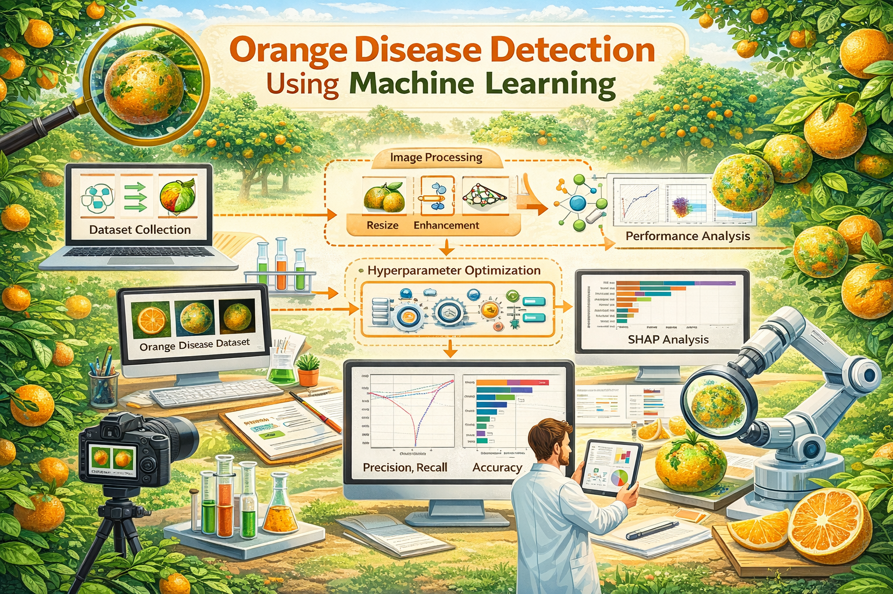

  

# A ROI-Guided Optimized Machine Learning Framework for Orange Disease Recognition with Feature Selection and Explainability

## Abstract
Orange is one of the most economically significant citrus crops worldwide which plays a vital role in global food supply chains and supports rural livelihoods. However, its high susceptibility to destructive diseases results in substantial yield losses and long-term economic damage. Despite recent advances in smart agriculture, early and accurate diagnosis of diseases is challenging due to visual resemblance among disease symptoms, high computational cost and limited model interpretability. To address these challenges, we propose a novel lightweight and ROI-guided explainable machine learning framework to identify orange disease that integrates a strategic feature selection method with Adaptive Step-Controlled Gorilla Troops Optimizer (ASC-GTO).  The proposed method starts with CLAHE-based image enhancement followed by K-means clustering to accurately segment and separate the diseased part which is labelled as the Region of Interest (ROI). To extract discriminative features from the ROI, GLCM based texture and color features are first extracted. LASSO is then used for ranking the features and finding the most discriminative features for each class. Finally, the proposed feature selection method integrates the union and intersection of top features identified in the class-wise scenario using LASSO with globally dominant features found by feature ranking to get a compact and discriminative feature subset for better multi-class classification. Model hyperparameter optimization was performed using the proposed Adaptive Step-Controlled Gorilla Troops Optimizer (ASC-GTO). Experimental results demonstrate that the proposed approach outperforms existing methods, achieving an accuracy of 99.57% on the widely adopted orange disease dataset from Kaggle. Furthermore, it significantly reduces computational complexity, with reductions of 25%, 24.44%, and 2.25% in training time, model size and error rate, respectively, compared to models trained on unprocessed raw input images. Model explainability is further analyzed using SHAP and LIME to identify the most influential features contributing to the prediction outcomes. Overall, by facilitating early disease intervention, the proposed method advances precision agriculture and sustainable farming by minimizing financial losses and enhancing food safety.